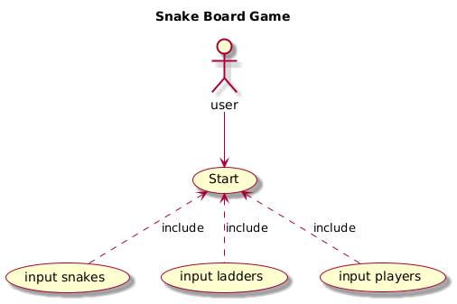
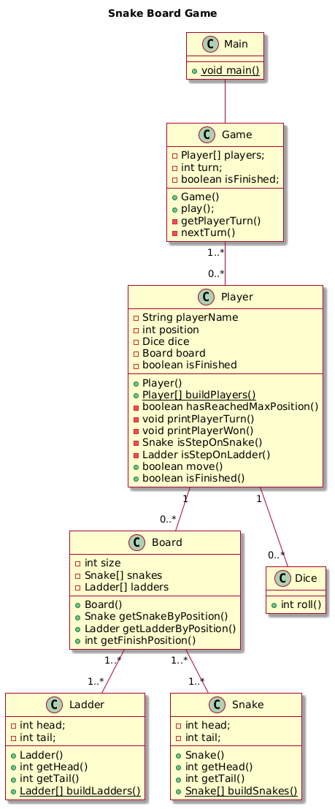

# java-snake-board-game

## How to run

1. clone the repository

```bash
git clone git@github.com:nathanaelsanilo/java-snake-board-game.git
```

2. move to the directory

```bash
cd java-snake-board-game
```

3. compile and run

```bash
javac main/Main.java
java main/Main
```

## Expectation

#### Documentation

- :white_check_mark: Identify use case of the code on UML Use case diagram
- :white_check_mark: identify class involved on UML class diagram

#### Code

- :white_check_mark: Make sure that you have a working and demonstrable code
- :white_check_mark: Make sure that the code is functionally correct
- :white_check_mark: Code should be modular and readable
- :white_check_mark: Separation of concern should be addressed
- :white_check_mark: Please do not write everything in a single file
- :white_check_mark: Code should easily accommodate new requirements and minimal changes
- :white_check_mark: There should be a main method from where the code could be easily testable
- :white_check_mark: No need to create a GUI

## Documentation

#### Use Case Diagram



```
@startuml

skin rose

title Snake Board Game

:user: --> (Start)

(Start) <.. (input snakes) : include
(Start) <.. (input ladders) : include
(Start) <.. (input players) : include

@endumls
```

#### Class Diagram



```@startuml
@startuml

skin rose

title Snake Board Game

class Main {
  + {static} void main()
}

class Board {
  -int size
  -Snake[] snakes
  -Ladder[] ladders
  +Board()
  +Snake getSnakeByPosition()
  +Ladder getLadderByPosition()
  +int getFinishPosition()
}

class Dice {
  +int roll()
}

class Game {
  - Player[] players;
  - int turn;
  - boolean isFinished;
  + Game()
  + play();
  - getPlayerTurn()
  - nextTurn()
}

class Ladder {
  - int head;
  - int tail;
  + Ladder()
  + int getHead()
  + int getTail()
  + {static} Ladder[] buildLadders()
}

class Player {
  - String playerName
  - int position
  - Dice dice
  - Board board
  - boolean isFinished
  + Player()
  + {static} Player[] buildPlayers()
  - boolean hasReachedMaxPosition()
  - void printPlayerTurn()
  - void printPlayerWon()
  - Snake isStepOnSnake()
  - Ladder isStepOnLadder()
  + boolean move()
  + boolean isFinished()
}

class Snake {
  - int head;
  - int tail;
  + Snake()
  + int getHead()
  + int getTail()
  + {static} Snake[] buildSnakes()
}

Main -- Game
Board "1..*" -- "1..*" Snake
Board "1..*" -- "1..*" Ladder
Game "1..*" -- "0..*" Player
Player "1" -- "0..*" Dice
Player "1" -- "0..*" Board

@enduml
```
